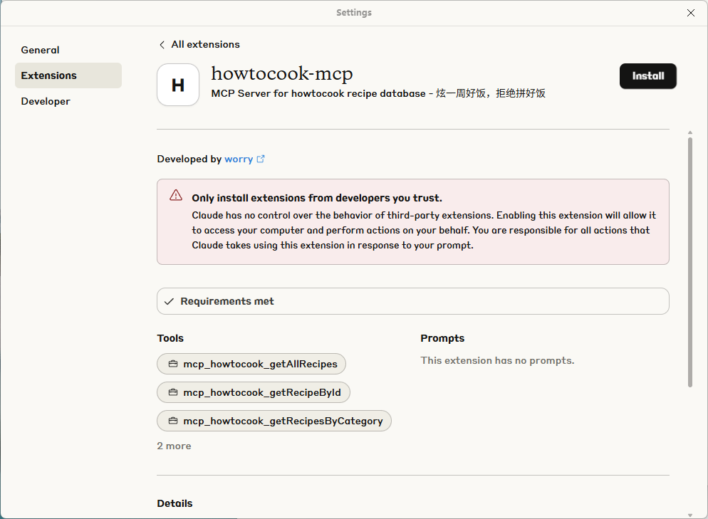
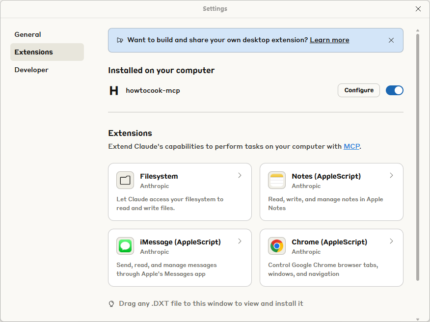
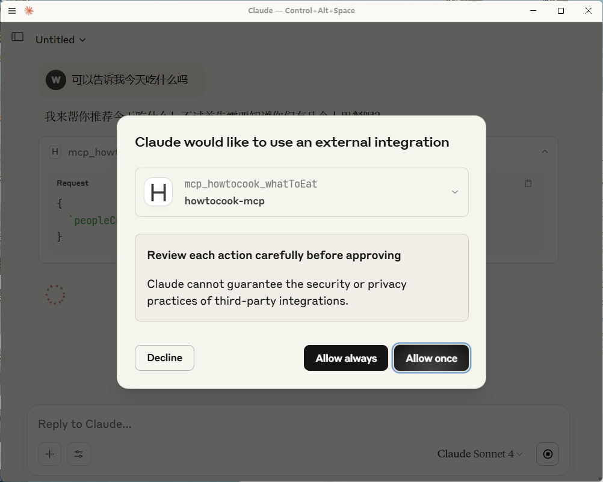

# 🍳 HowToCook-MCP Server 🥘 -- 炫一周好饭，拒绝拼好饭

[English](./README_EN.md) | 简体中文

<div align="center">

本项目 CDN 加速及安全防护由 Tencent EdgeOne 赞助

[亚洲最佳 CDN、边缘和安全解决方案 - Tencent EdgeOne](https://edgeone.ai/zh?from=github)


</div>

> 让 AI 助手变身私人大厨，为你的一日三餐出谋划策！

基于[Anduin2017/HowToCook](https://github.com/Anduin2017/HowToCook)打造的 MCP(Model Context Protocol)服务器，让 AI 助手能够为你推荐菜谱、规划膳食，解决"今天吃什么"的世纪难题！

数据来源：[Anduin2017/HowToCook](https://github.com/Anduin2017/HowToCook) ⭐ 没有 star 的同学快去点个星星吧！

🎉 **想直接使用当前 MCP？立即体验** [https://howtocookmcp.weilei.site/](https://howtocookmcp.weilei.site/)

🎉 **同时，我们也提供了 DXT（Desktop Extensions）供大家体验，一键安装到 Claude Desktop**

如下：请确保你已经安装了最新版的 Claude Desktop, 当前 MCP 的 DXT 文件已上传代码库，可以自行下载或者 Fork 本仓库自行构建





本地开发如何打包成 DXT？

1.运行 `npm install -g @anthropic-ai/dxt`

2.在包含本地 MCP 服务器的文件夹中，运行 `dxt init`。也就是您 MCP 的根目录，此命令将引导您创建`manifest.json`

3.运行`dxt pack`创建 dxt 文件

现在，任何支持 DXT 的应用都可以运行您的本地 MCP 服务器。例如，使用适用于 macOS 和 Windows 的 Claude 打开该文件即可显示安装对话框

具体参阅:[anthropics/dxt](https://github.com/anthropics/dxt)

## 📸 效果预览


## 🔌 支持的 MCP 客户端

本服务器适用于所有支持 MCP 协议的 AI 助手和客户端，包括但不限于：

- 🤖 Claude 桌面应用
- 📝 Cursor
- 💼 其他支持 MCP 的客户端

## ✨ 美味功能

该 MCP 服务器提供以下美食工具:

1. **📚 查询全部菜谱** - 获取所有可用菜谱数据，做菜百科全书 -- 慎用这个--上下文太大
2. **🔍 根据分类查询菜谱** - 按照分类筛选菜谱，想吃水产？早餐？荤菜？主食？一键搞定！
3. **📖 查询指定菜谱** - 根据菜谱名称查询特定菜谱的完整详情，包括食材、步骤等
4. **🧩 智能推荐膳食** - 根据你的忌口、过敏原和用餐人数，为你规划整整一周的美味佳肴
5. **🎲 不知道吃什么** - 选择困难症福音！根据人数直接推荐今日菜单，再也不用纠结了

## 🚀 快速上手

### 📋 先决条件

- Node.js 16.0.0+ 🟢
- npm 或 yarn 📦

### 💻 安装步骤

1. 克隆美食仓库

```bash
git clone https://github.com/worryzyy/howtocook-mcp.git
cd howtocook-mcp
```

2. 安装依赖（就像准备食材一样简单！）

```bash
npm install
```

3. 编译代码（烹饪过程...）

```bash
npm run build
```

### 🎯 命令行参数

服务器支持以下命令行参数：

- `--transport <stdio|http|sse>` - 选择传输方式（默认为 stdio）
- `--port <number>` - 使用 http 或 sse 传输时的监听端口（默认为 3000）

示例：使用 http 传输并监听 8080 端口

```bash
node build/index.js --transport http --port 8080
```

## 🍽️ 开始使用

### 🔥 启动服务器

```bash
npm start
```

### 🔧 配置 MCP 客户端

#### 推荐使用 Cursor 快速体验(两种方式)

1. 使用 npm 包：请先运行 `npm i -g howtocook-mcp` ,否则会出现 `Failed to create client`

然后在 Cursor 设置中添加 MCP 服务器配置：

```json
{
	"mcpServers": {
		"howtocook-mcp": {
			"command": "npx",
			"args": ["-y", "howtocook-mcp"]
		}
	}
}
```

2. 如果是克隆仓库本地运行，请使用如下配置

```json
{
	"mcpServers": {
		"howtocook-mcp": {
			"command": "node",
			"args": ["youpath\\howtocook-mcp\\build\\index.js"]
		}
	}
}
```

#### 其他 MCP 客户端

对于其他支持 MCP 协议的客户端，请参考各自的文档进行配置，通常需要指定：

- 服务器名称: `howtocook-mcp`
- 命令: `npx -y howtocook-mcp`

3. 重启客户端，让美食魔法生效 ✨

## 🧙‍♂️ 菜单魔法使用指南

以下是在各种 MCP 客户端中使用的示例提示语：

### 1. 📚 查询全部菜谱

无需参数，直接召唤美食全书！

```
请使用howtocook的MCP服务查询所有菜谱
```

### 2. 🔍 根据分类查询菜谱

```
请使用howtocook的MCP服务查询水产类的菜谱
```

参数:

- `category`: 菜谱分类（水产、早餐、荤菜、主食等）

### 3. 🧩 智能推荐一周菜谱

```
请使用howtocook的MCP服务为3人推荐一周菜谱，我们家不吃香菜，对虾过敏
```

参数:

- `allergies`: 过敏原列表，如 ["大蒜", "虾"]
- `avoidItems`: 忌口食材，如 ["葱", "姜"]
- `peopleCount`: 用餐人数 (1-10)

### 4. 🎲 今天吃什么？

```
请使用howtocook的MCP服务为4人晚餐推荐菜单
```

参数:

- `peopleCount`: 用餐人数 (1-10)

## 📝 小贴士

- 该包已发布至 npm，可直接通过`npm install -g howtocook-mcp`全局安装
- 本服务兼容所有支持 MCP 协议的 AI 助手和应用
- 首次使用时，AI 可能需要一点时间来熟悉如何使用这些工具（就像烧热锅一样）

## 🤝 贡献

欢迎 Fork 和 Pull Request，让我们一起完善这个美食助手！

## 📄 许可

MIT License - 随意使用，就像分享美食配方一样慷慨！

---

> 🍴 美食即将开始，胃口准备好了吗？

## 写在最后

平时关注 MCP 比较多，特意新建了一个 MCP 的群聊，欢迎各位大佬加群讨论更多 MCP 的话题


或者直接加作者 VX 进群：`worry3stone`, 请注明`MCP Exchange`，否则会被忽略哦
